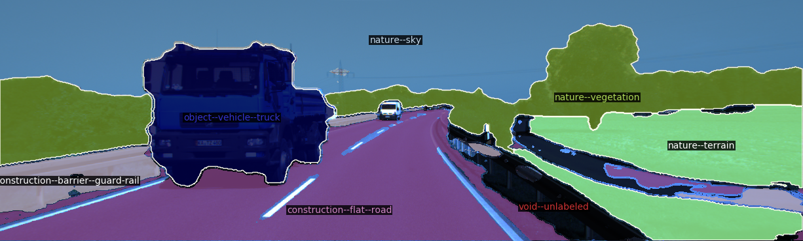
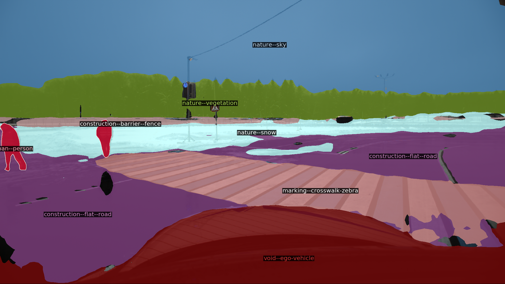

# Tool for visualization of semantic segmentation masks with class names

## Script usage:
```
python run_visualization.py
```

## Examples
<p align="center">
  
</p>
<p align="center">
  
  
</p>
